# Music Quiz 
[View the live site here](https://music-quiz-pp3.herokuapp.com/)

## Mockups
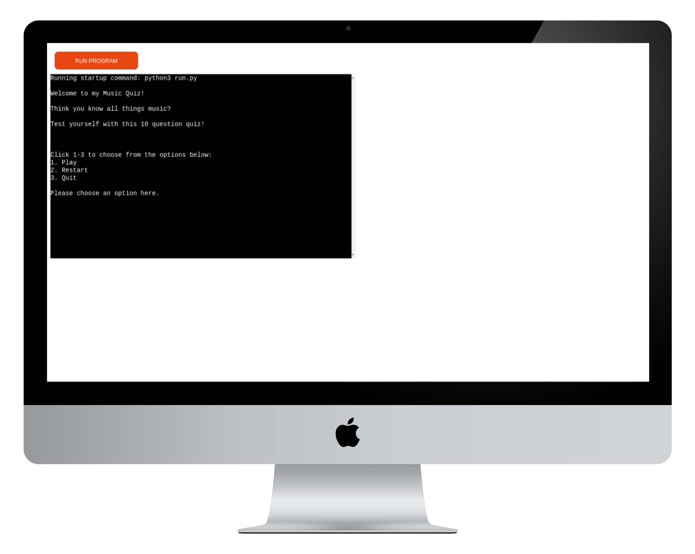
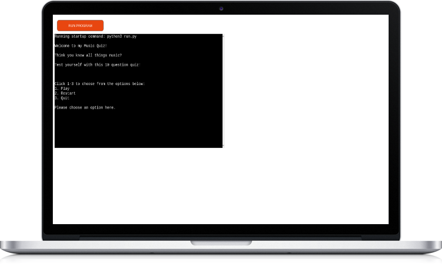

## Introduction
This is a music quiz. It features questions from various genres and decades to suit all music lovers. The aim of the game is for the user to test their knowledge on all things music. 
I decided to make a music quiz as I am an avid music and quiz lover. 

## Features
### Intro Message 
Upon visiting the site, the user is met with an intro explaining what the quiz is about. 
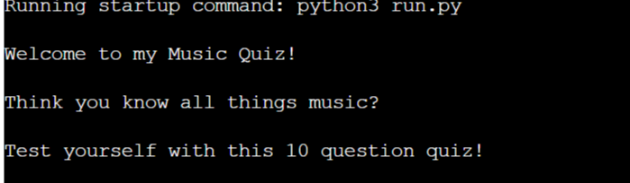

### Intructions
Following the intro, the user recieves 3 options, Play, reset or quit. They can choose which option they wish to go with my typing 1, 2 or 3.  
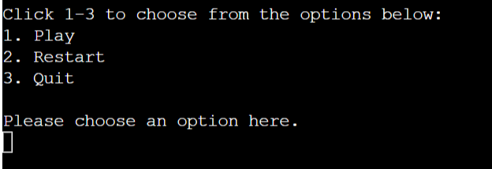 
If the user tries to choose any other number then those specified, they will be met with an error message. 
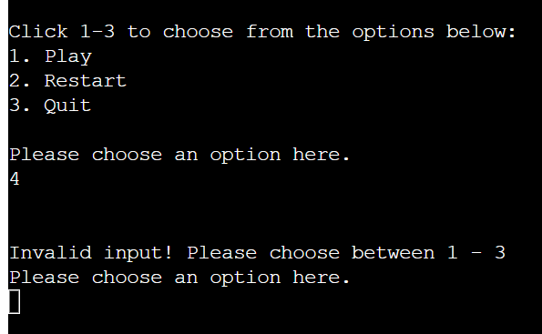
### Play/Restart
If the users chooses to 'Play' or 'Restart', they will be met with the following: 
1. Success Message 
This shows the user that their selection has been successful. 

2. Create Username 
The user is asked to create a username for the game. They are given instructions to follow ( Only A-Z and 0-9 are allowed, no special characters). 
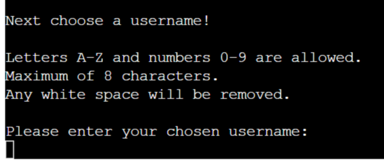
3. Username Success
When the user enters their username (as per guildelines), they are met with another success message to let them know their username has been accepted. They also receieve further instructions on how to play the game. 
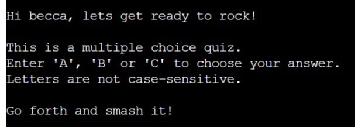
4. Username Unsuccessful 
If the user tries to use special characters or a username thats more than 8 characters, they will be met with an error message and asked to resubmit a username within the guidelines - the game will not begin until they do so. 
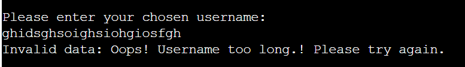
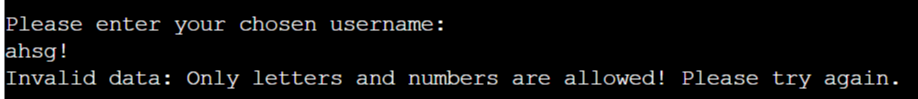
5. Questions
After the user has submitted a username within the guidelines, they are presented with their first question. If they answer correctly, they are met with a success message, their score is incremented by 1 and they are moved on automatically to the next question.  
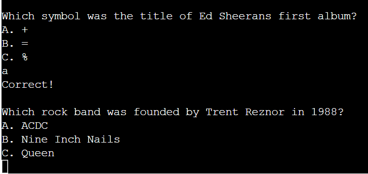 
If the user answers incorrectly, they are met with an error message and told what the correct answer was. The score does not go up and they are mnoved onto the next question.  
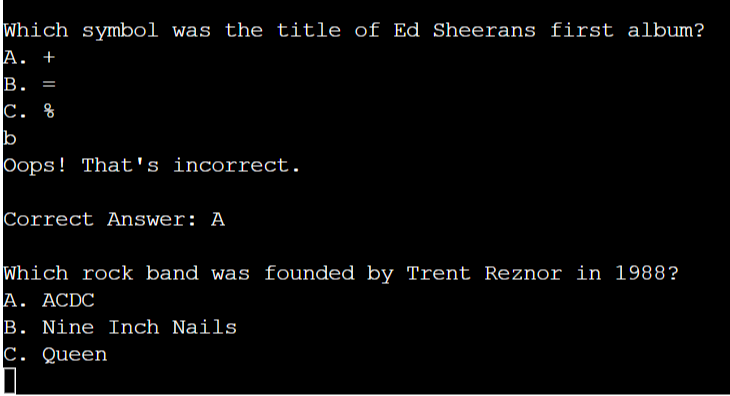 
If the user tries to select any other letter than a,b or c - they are met with an error message and are asked to attempt the question again.  
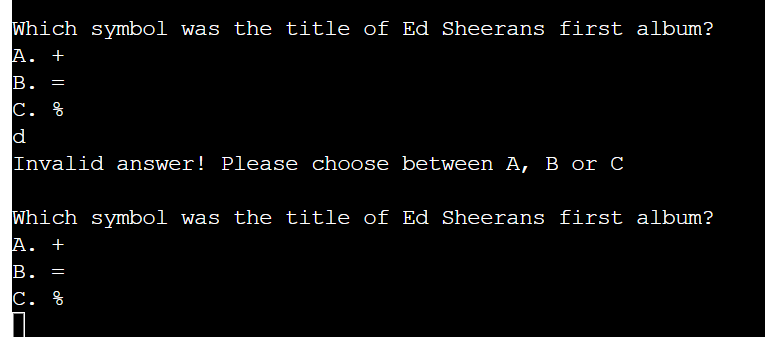 
6. Final Score
When the user finishes all 10 questions, they will recieve their final score. 
- If the score is <= 4, the user is met with a try again message. The main manu reappears for the user to decide what they would like to do. 
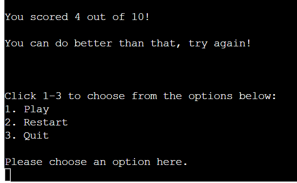 
- If the user scores between 5-7, they are met with a good job message.The main manu reappears for the user to decide what they would like to do. 
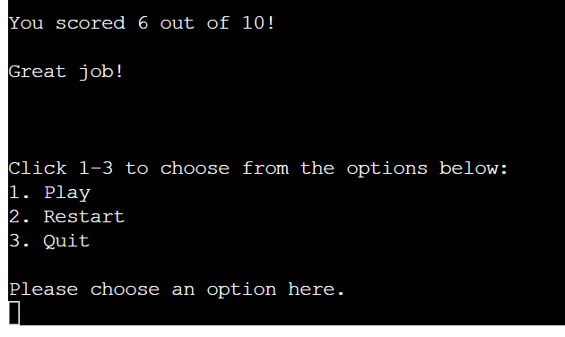 
- If the user scores between 8+, they are met with a unreal job message.The main manu reappears for the user to decide what they would like to do. 
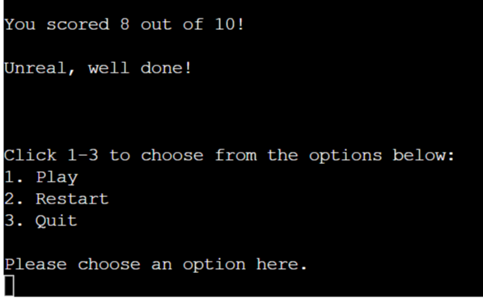 

### Quit 
If the user chooses to quit, they are met with a goodbye message and the game ends.  
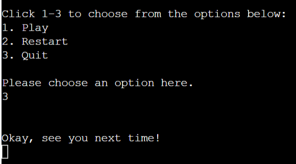 

## Features left to implement 
In the future, i would like to add a leaderboard with highscores. I would do this by using an google sheets API. I wanted to implement this in my final project but time did not allow. 

## Testing 
I tested my code by usings PEP8 Online Checker which can be found here: http://pep8online.com/
Below are my results for both run.py and quiz.py pages.  
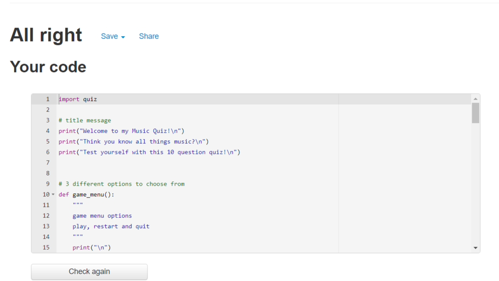 
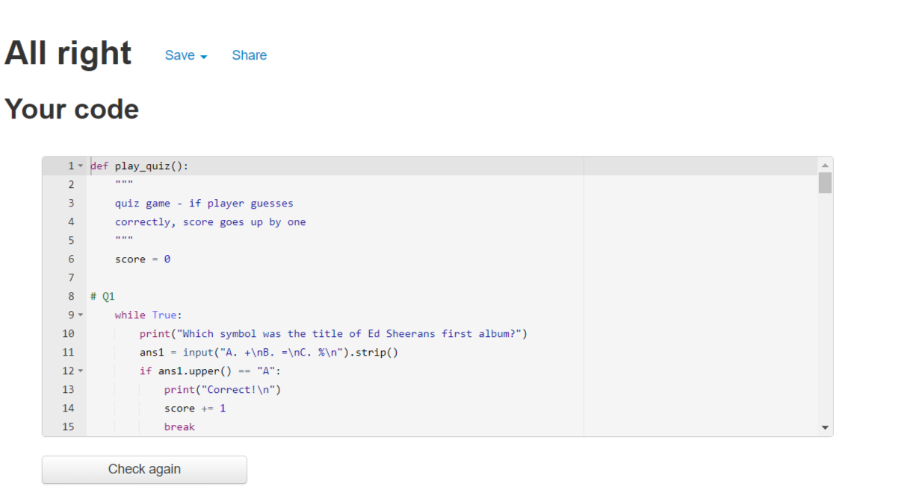 

### Bugs
I have not found any bugs in this project. 

## Technology 
1. Github for storing and version control. 
2. Gitpod for editing code. 
3. Heroku for deployment. 
4. Fireshot for screenshots. 
5. Python Cheat Sheet - https://www.pythoncheatsheet.org/
6. CI Course Material. 
7. PEP8 for testing. 
8. https://www.radiotimes.com/quizzes/pub-quiz-music-round/ - questions & answers. 

## Deployment 
1. Log into Heroku website or create a free account if you dont have one. 
2. Click 'new' on the top right of the dashboard then click 'create new app'. 
3. Choose a unique app name and the region you're in - when happy, click 'creat app'. 
4. In the next page, choose 'settings'. 
5. Set two config vars - CREDS.json & PORT (key) 8000 (value). 
6. Add two buildpacks, Python & nodejs - in this order only. 
7. Navigate to the deploy tab and connect your github account. 
8. At the bottom of the page, choose 'Manual Deploy'from the main branch. 
9. Click 'Deploy Branch'. 

This will take a minute or two and your project is deployed. You can choose to enable automatic depolys if you wish also. 

## Credits 
1. Code Institute Course Material & Love Sandwiches walkthrough. 
2. Python Cheat Sheet - mentioned above. 

## Acknowledgments
1. Slack community 
2. Stryker programming team for their tips, tricks and support. 
3. My family for their continued support thoughtout my projects and study hours. 
4. Myself, for sticking with it. 
